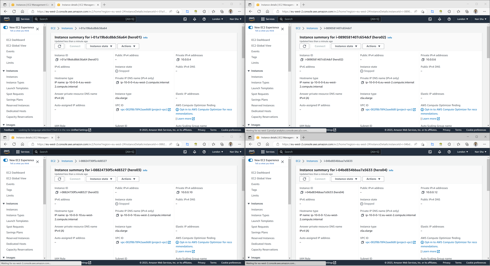
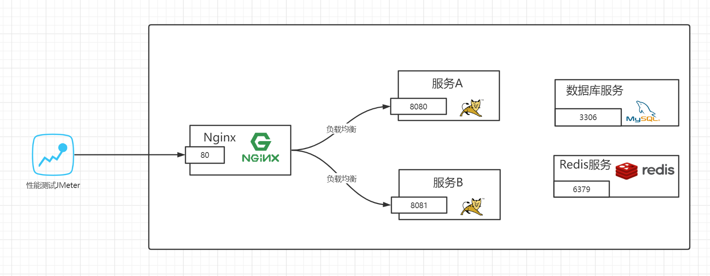
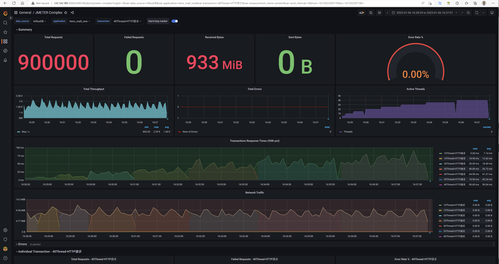
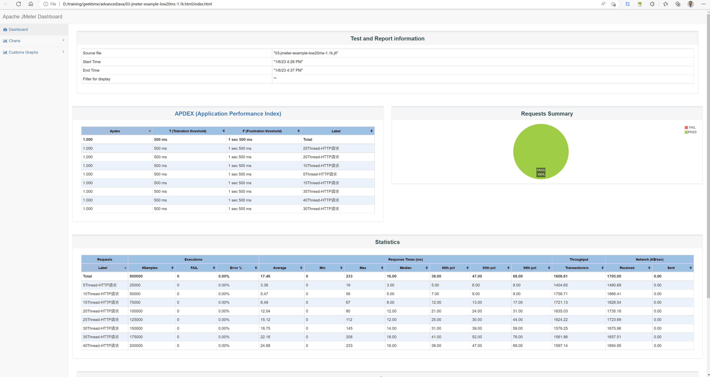
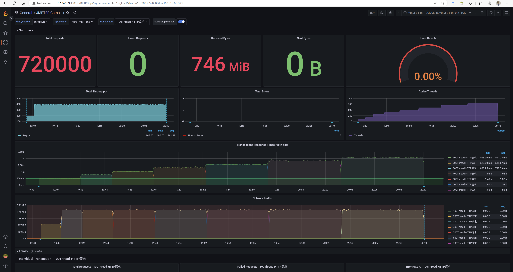
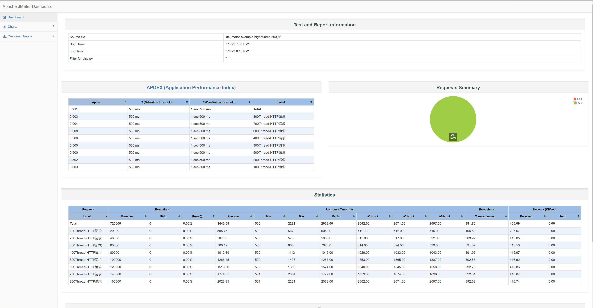

# home work

要求 01- 搭建好压测监控平台

在AWS环境搭建，具体步骤参考老师提供的资料和 高级Java体系课笔记/01-环境搭建-个人实践操作.md

要求 02- 使用自己手里的项目的接口完成压测，分析出至少一个性能问题，并给出理由

这个手上没有合适的，还是用课程提供的
/spu/goods/10000023827800

要求 03- 被测试的接口的性能指标 RT、TPS，系统资源（内存、CPU、磁盘 IO、网络 IO）使用
Grafana 观察取证
要求 04- 按照 项目性能测试报告 格式提交作业

# 项目性能测试报告

## 01-测试目的

主要是让开发者对hero_mall项目的性能负载和容量有个准确的认知。同时，协助技术管理者更好的管理业务系统性能质量，科学评估业务系统的负荷，拒绝盲目上线。

## 02-测试工具

## 03-测试环境

### 3.1 环境

| 指标              | 参数 |
| ----------------- | ---- |
| 机器              | 4C8G |
| 集群规模          | 单机 |
| hero_mall_one版本 | 1.0  |
| 数据库            | 4C8G |

### 3.1 设置启动参数

## 04-测试场景

测试场景一般情况下是都是最重要接口：验证hero_mall服务获取商品信息接口在不同并发规模的表现

** 情况01-模拟低延时场景，**用户访问接口并发逐渐增加的过程。接口的响应时间为20ms，线程梯度：5、10、15、20、25、30、35、40个线程，5000次;

- 时间设置：Ramp-up period(inseconds)的值设为对应线程数
- 测试总时长：约等于20ms x 5000次 x 8 = 800s = 13分

** 情况02-模拟高延时场景，**用户访问接口并发逐渐增加的过程。接口的响应时间为500ms，线程梯度：100、200、300、400、500、600、700、800个线程，200次; 

- 时间设置：Ramp-up period(inseconds)的值设为对应线程数的1/10；
- 测试总时长：约等于500ms x 200次 x 8 = 800s = 13分

## 05-核心接口的测试结果

### Low latency 情况01
03-jmeter-example-low20ms-1.1k.html

### High latency 情况02
04-jmeter-example-high500ms-800.html

## 06-测试结论

### 低延迟的情况下
- 响应时间和吞吐量都比较稳定，响应时间在增加但是也都很小。当然这个测试的线程数都比较少，所以都比较平缓

### 高延迟的情况下
- 当并发线程超过200以后，响应时间指标 99% RT开始远远超过默认的500ms；而吞吐量tps仍然很稳定。因为测试使用内网，所以这里的瓶颈可以是应用的并发能力，比如课中提到的更改tomcat线程数。
-